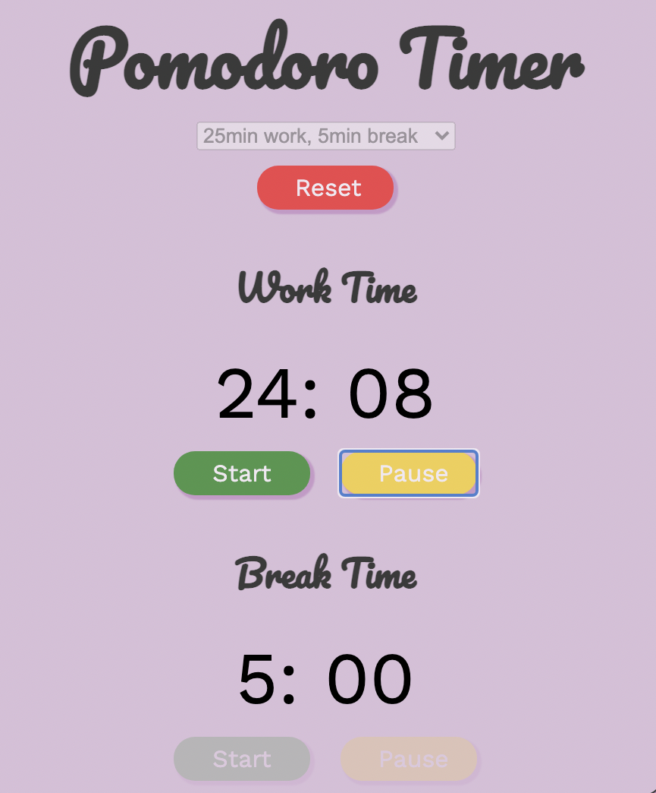

# JavaScript Pomodoro Timer

### A Pomodoro Timer build with HTML, CSS, and JavaScript 

### See it [here](https://bryangk.github.io/pomodoro/)

## Summary
A timer to increase productivity by breaking your workday into 25min work and 5min break periods. Part of the base projects in SDMM. This one got me familiar with making countdown timers, manipulating the DOM, adding event listeners, and practicing some CSS styling. I added the extra dropdown menu for selecting a different work/break timer.

## Author

Bryan Krauss - Full Stack Software Developer [LinkedIn](https://www.linkedin.com/in/bryan-krauss-556b3a200/)